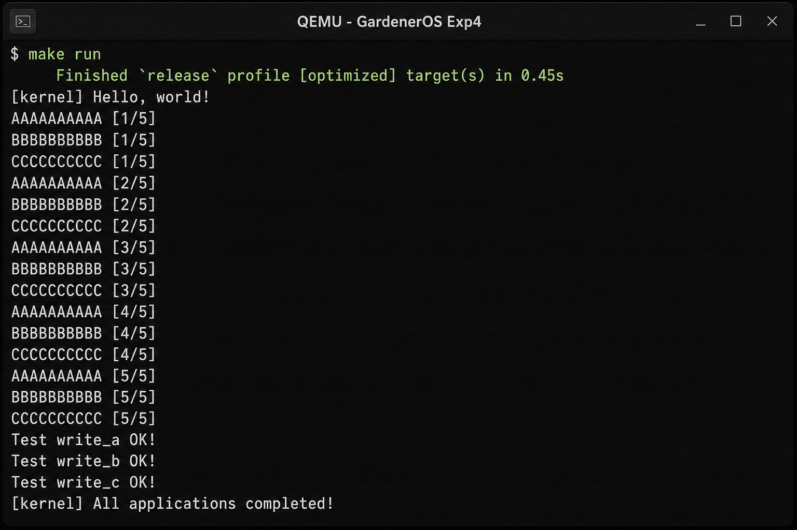

# 实验4：多道程序与协作式调度 — 实验报告

## 1. 实验信息

| 项目 | 内容 |
|------|------|
| 实验名称 | 多道程序与协作式调度 |
| 实验环境 | Docker (openEuler) + Rust nightly + QEMU riscv64 virt |
| 项目目录 | GardenerOS |
| 完成日期 | 2026-03-06 |

## 2. 实验目的

实现一个支持**多道程序**和**协作式调度**的操作系统内核。多个用户程序同时驻留内存，程序在执行 I/O 或主动调用 `yield` 时让出 CPU，由内核切换到其他就绪任务继续执行。

## 3. 实验内容与实现

### 3.1 用户程序：多地址加载

批处理系统中所有程序链接到同一基址；多道程序要求每个程序占用不同内存区域。

- **`user/build.py`**：为每个应用动态修改 `linker.ld` 中的 `BASE_ADDRESS`（步长 `0x20000`），依次编译各 bin 目标。
- **`user/Makefile`**：调用 `build.py` 生成 ELF，再用 `rust-objcopy` 转为 `.bin` 文件。

基址分配示例：

| 应用 | 加载地址 |
|------|----------|
| 00write_a | 0x80400000 |
| 01write_b | 0x80420000 |
| 02write_c | 0x80440000 |

### 3.2 yield 系统调用

在 `user/src/syscall.rs` 中新增 `SYSCALL_YIELD (124)`，用户库封装为 `yield_()`。

内核侧在 `os/src/syscall/process.rs` 实现 `sys_yield()`，调用 `suspend_current_and_run_next()` 将当前任务标记为 Ready 并切换至下一就绪任务。

### 3.3 测试应用程序

三个测试程序分别输出字符 A、B、C，每行输出后调用 `yield_()` 主动让出 CPU：

- `user/src/bin/00write_a.rs`
- `user/src/bin/01write_b.rs`
- `user/src/bin/02write_c.rs`

### 3.4 多道程序加载（loader 模块）

`os/src/config.rs` 定义：

```rust
pub const MAX_APP_NUM: usize = 4;
pub const APP_BASE_ADDRESS: usize = 0x80400000;
pub const APP_SIZE_LIMIT: usize = 0x20000;
```

`os/src/loader.rs` 核心流程：

1. 从链接脚本段 `_num_app` 读取应用数量及二进制起止地址；
2. 对每个应用：清零目标区域 → 从内核数据段拷贝到 `get_base_i(i)` 计算出的物理地址；
3. `init_app_cx()` 在内核栈上压入 Trap 上下文和 Task 上下文，供首次调度使用。

### 3.5 任务设计与协作式调度

**任务上下文**（`os/src/task/context.rs`）：保存 `ra` 和 `s0–s11` 共 13 个寄存器。

**任务控制块**（`os/src/task/task.rs`）：维护 `task_cx_ptr` 和 `TaskStatus`（UnInit / Ready / Running / Exited）。

**任务切换**（`os/src/task/switch.S`）：`__switch` 保存当前任务上下文，恢复下一任务上下文，不涉及特权级切换。

**任务管理器**（`os/src/task/mod.rs`）：

- `run_first_task()`：启动第一个任务；
- `find_next_task()`：环形扫描 Ready 任务；
- `suspend_current_and_run_next()`：协作式让出（yield / 挂起）；
- `exit_current_and_run_next()`：任务退出后切换。

### 3.6 其他修改

- `trap/trap.S` 中 `__restore` 的 `mv sp, a0` 已注释（任务切换保证 sp 正确）；
- `trap/mod.rs` 不再调用批处理的 `run_next_app()`；
- `main.rs` 流程：`trap::init()` → `loader::load_apps()` → `task::run_first_task()`。

## 4. 运行结果

在 `os` 目录执行 `make run`，QEMU 输出如下（三个程序交替打印，体现协作式调度）：



可以看到 A、B、C 三类输出严格交替出现，说明每次 `yield_()` 后内核正确切换到下一个就绪任务；全部完成后内核打印 `[kernel] All applications completed!` 并关机。

## 5. 思考题

### （1）应用程序是如何加载的？

编译阶段，`build.py` 为每个应用生成独立链接地址的 ELF，再转为 `.bin`。`os/build.rs` 将所有 `.bin` 嵌入内核镜像，生成 `link_app.S`，其中 `_num_app` 段记录应用数量及各 bin 在内核数据段中的起止指针。

内核启动时 `loader::load_apps()` 读取这些信息，按 `APP_BASE_ADDRESS + id × APP_SIZE_LIMIT` 计算物理地址，清零后逐字节拷贝到内存，完成加载。加载时机为**内核初始化阶段一次性全部加载**，而非按需加载。

### （2）多道程序如何设计和实现的？

设计上将"加载"与"执行"解耦：`loader` 负责内存布局与拷贝，`task` 负责调度与切换。每个应用拥有独立的用户栈、内核栈和内存区域，互不覆盖。

实现上通过 `TaskManager` 维护固定数量（最多 4 个）的任务控制块，采用简单环形就绪队列调度。协作式调度意味着**只有任务主动 yield 或退出时才发生切换**，内核不强制打断正在运行的任务。

### （3）任务与理论课程中进程、线程的区别和联系

| 维度 | 本实验任务 | 进程 | 线程 |
|------|-----------|------|------|
| 地址空间 | 各应用独立基址，无 MMU 隔离 | 独立虚拟地址空间 | 共享进程地址空间 |
| 切换开销 | 仅保存 callee-saved 寄存器 | 切换页表 + 上下文 | 仅切换上下文 |
| 调度方式 | 协作式（yield） | 通常抢占式 | 可协作或抢占 |
| 联系 | 可视为"无 MMU、无文件系统的极简进程" | — | 同一进程内的轻量执行流 |

本实验的"任务"本质上是**裸机上的用户态程序实例**，具备独立栈和 PC，但缺少页表隔离、信号、文件描述符等完整进程语义。

## 6. 实验总结

本实验完成了从批处理到多道程序的升级：多个应用同时驻留内存，通过 `yield` 系统调用实现协作式调度。核心新增模块为 `loader`（加载）和 `task`（上下文切换 + 任务管理），为后续实验5的抢占式调度奠定了基础。
