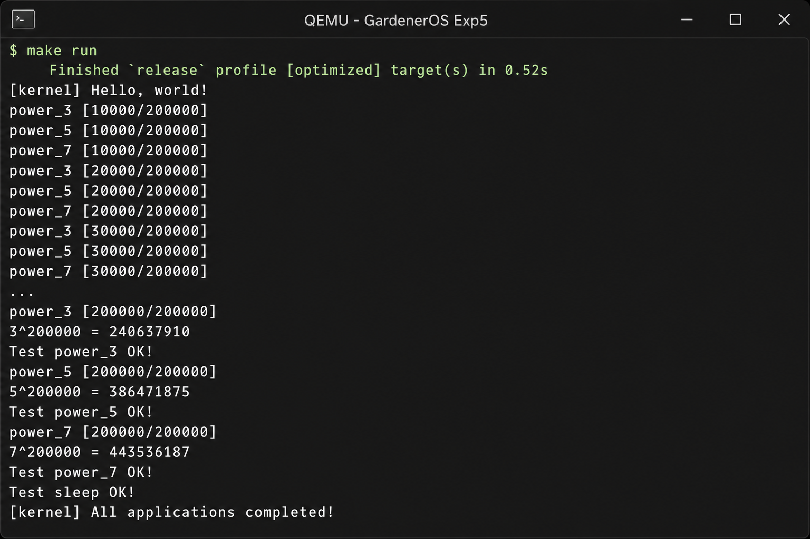

# 实验5：分时多任务与抢占式调度 — 实验报告

## 1. 实验信息

| 项目 | 内容 |
|------|------|
| 实验名称 | 分时多任务与抢占式调度 |
| 实验环境 | Docker (openEuler) + Rust nightly + QEMU riscv64 virt |
| 项目目录 | GardenerOS |
| 完成日期 | 2026-03-06 |

## 2. 实验目的

在实验4多道程序基础上，引入**时钟中断**和**计时器**，实现**分时多任务**与**抢占式调度**。即使应用程序不主动 yield，内核也能在时钟中断时强制切换任务，保证 CPU 时间公平分配。

## 3. 实验内容与实现

### 3.1 时钟中断与计时器

RISC-V virt 机器通过 `mtime` / `mtimecmp` 寄存器实现时钟中断。

**`os/src/timer.rs`**：

```rust
pub fn get_time() -> usize { time::read() }

pub fn set_next_trigger() {
    set_timer(get_time() + CLOCK_FREQ / TICKS_PER_SEC);  // 100 Hz
}

pub fn get_time_ms() -> usize {
    time::read() / (CLOCK_FREQ / MSEC_PER_SEC)
}
```

**`os/src/sbi.rs`**：封装 `SBI_SET_TIMER` 调用，设置 `mtimecmp` 触发下一次 Supervisor 时钟中断。

**`os/src/config.rs`**：新增 `CLOCK_FREQ = 12500000`（QEMU virt 默认频率）。

### 3.2 get_time 系统调用

- 用户态：`SYSCALL_GET_TIME (169)` → `get_time()` 返回毫秒级时间戳；
- 内核态：`sys_get_time()` 调用 `get_time_ms()` 返回当前计数。

### 3.3 测试应用程序

| 应用 | 功能 |
|------|------|
| `00power_3.rs` | 计算 3^200000 mod 998244353，每 10000 次打印进度 |
| `01power_5.rs` | 同上，底数为 5 |
| `02power_7.rs` | 同上，底数为 7 |
| `03sleep.rs` | 通过 `get_time()` + `yield_()` 忙等待 3 秒后打印 OK |

三个 power 程序均为**纯计算型**，不会主动 yield，用于验证抢占式调度是否生效。

### 3.4 抢占式调度实现

**`os/src/trap/mod.rs`** 关键修改：

```rust
pub fn enable_timer_interrupt() {
    unsafe { sie::set_stimer(); }
}

// trap_handler 中新增：
Trap::Interrupt(Interrupt::SupervisorTimer) => {
    set_next_trigger();
    suspend_current_and_run_next();
}
```

**`os/src/main.rs`** 启动流程增加：

```rust
trap::enable_timer_interrupt();
timer::set_next_trigger();
task::run_first_task();
```

时钟中断触发时，内核重新设置下一次中断时间，并调用 `suspend_current_and_run_next()` 强制切换任务——这就是**抢占式调度**的核心。

### 3.5 与实验4的继承关系

实验5在实验4的 loader、task、switch 框架上扩展，无需重写任务切换逻辑。主要增量为：

- 新增 `timer` 模块；
- trap 处理增加时钟中断分支；
- 用户程序替换为计算密集型 + sleep 测试。

## 4. 运行结果

在 `os` 目录执行 `make run`，QEMU 输出如下：



关键观察：

1. **power_3 / power_5 / power_7 进度交替打印**，说明三个计算任务被时钟中断轮流抢占，实现分时执行；
2. 各 power 程序最终输出正确结果并打印 `Test power_X OK!`；
3. `03sleep` 通过 `get_time()` 精确等待约 3 秒后输出 `Test sleep OK!`；
4. 全部完成后内核打印 `[kernel] All applications completed!`。

## 5. 思考题

### （1）分时多任务是如何实现的？

通过 SBI 设置 `mtimecmp`，使 QEMU virt 机器每隔 `CLOCK_FREQ / 100` 个时钟周期（即 10 ms）产生一次 Supervisor 时钟中断。每次中断时内核调用 `set_next_trigger()` 预约下一次中断，并执行 `suspend_current_and_run_next()` 切换到下一个 Ready 任务。

这样，每个任务每次最多连续运行约 10 ms，多个任务"分时"共享 CPU，从用户视角看像是"同时"运行。

### （2）抢占式调度是如何设计和实现的？

设计思路：在协作式调度基础上，增加**时钟中断作为强制调度点**。任何正在运行的任务（包括不调用 yield 的计算循环）都会在时钟中断到来时被挂起。

实现路径：

```
时钟中断 → trap_handler → set_next_trigger() + suspend_current_and_run_next()
                                    ↓
                          mark_current_suspended() → find_next_task() → __switch()
```

与实验4的区别在于：**调度触发源从"用户主动 yield"扩展为"内核时钟中断强制抢占"**。

### （3）协作式调度 vs 抢占式调度对比

| 对比项 | 协作式调度（实验4） | 抢占式调度（实验5） |
|--------|-------------------|-------------------|
| 切换时机 | 任务主动 yield 或 exit | yield / exit **或** 时钟中断 |
| CPU 占用 | 恶意/纯计算程序可独占 CPU | 时钟中断保证公平分配 |
| 实现复杂度 | 较低，无需处理中断中切换 | 需 timer + 中断使能 + 重入安全 |
| 响应性 | 依赖任务配合 | 有界延迟（≤ 时间片长度） |
| 适用场景 | 协作式 I/O 密集型 | 通用分时系统 |

实验4 的 write_a/b/c 程序每次打印后 yield，三者自然交替；实验5 的 power 程序从不 yield，若仍使用协作式调度则第一个程序会独占 CPU——实际运行中三者进度交替，直接证明了抢占式调度的有效性。

## 6. 实验总结

本实验在实验4多道程序框架上引入时钟中断机制，实现了分时多任务和抢占式调度。核心改动集中在 `timer` 模块和 `trap_handler` 的时钟中断分支，用户程序通过计算密集型和 sleep 测试验证了调度的正确性与公平性。至此，GardenerOS 已具备现代操作系统调度子系统的基本雏形。
